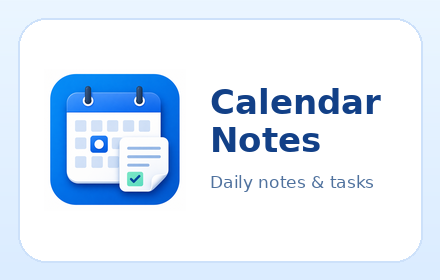

  

## Features

- Calendar panel toggled from the toolbar or **Tools → Toggle Calendar**.
- Days with existing notes or tasks are highlighted.
- Click a day to select it; sections below the calendar list that day's tasks and notes.
- Create Joplin todo tasks for a selected day, complete them from the calendar panel, configure simple recurring tasks, see task reminders, and keep overdue tasks visible in one place.
- Show undated todo tasks with configured tags in a separate collapsible section.
- Date and time formats follow Joplin's global settings (Tools → Options → General → Date format / Time format), with simple presets for new note titles.
- Separate notebooks and nested structures for calendar notes and tasks.
- Optional note and task templates with placeholders (`{{title}}`, `{{date}}` in Joplin's date format, `{{time}}` in Joplin's time format, `{{YYYY}}`, `{{MM}}`, `{{dd}}`, `{{date:dd.MM.YYYY}}`, …).
- Week starts on Monday or Sunday.
- English and Russian UI.

## Requirements

Joplin **3.5** or newer.

## Installation

**From Joplin:** Tools → Options → Plugins → search for *Calendar Notes*.

**Manual:** Tools → Options → Plugins → *Install from file* → select the `.jpl` file.

## Settings

Date and time values used by the plugin follow Joplin's global **Date format** and **Time format** (Tools → Options → General); there are no separate plugin settings for them.

| Setting | Purpose |
| --- | --- |
| New note title | Title preset for notes created by the plugin: date and time, or date with automatic numbering |
| Week starts on | Monday or Sunday |
| Notes: notebook | Notebook path for new calendar notes, e.g. `Calendar notes`; missing notebooks are created automatically |
| Notes: nested notebooks | Optional path inside the notes notebook, e.g. `{{year}}/{{month}}` |
| Notes: new note template | Joplin note used as a body template for new notes, e.g. `Templates/Calendar note`; template tags are copied to created notes |
| Tasks: notebook | Notebook path for new active todo tasks, e.g. `Tasks`; missing notebooks are created automatically |
| Tasks: completed notebook | Notebook path where completed tasks are moved, e.g. `Completed tasks`; missing notebooks are created automatically |
| Tasks: new task template | Joplin note used as a body template for new todo tasks, e.g. `Templates/Calendar task`; template tags are copied to created tasks |
| Tasks: tags (without date) | Comma-separated tag names for undated todo tasks shown in the calendar panel, e.g. `Watch,Do,Read` |

## How notes are matched

An item belongs to a day when its title starts with the date written in Joplin's date format, so renamed items like `25.01.2026 meeting` remain visible for that day.

## Undated tagged tasks

has no Joplin due date, and its title is not matched to any calendar day by Joplin's date format.

## Recurring tasks

Recurring tasks are ordinary Joplin todo notes with plugin metadata stored in synced Joplin user data. Use the `↻` button in the calendar panel to choose daily, weekly, monthly, or yearly repetition for a task. When a repeated task is completed, the next one is created. If `Tasks: new task template` is configured and readable, the next task body is rendered from the current template with fresh placeholders such as `{{title}}`, `{{date}}`, and `{{time}}`, and template tags are copied; otherwise the previous task body and tags are copied. If the task has a reminder, the next task keeps the same reminder offset from the task date, so reminders set before or after the task day stay intentional.

## License

MIT
